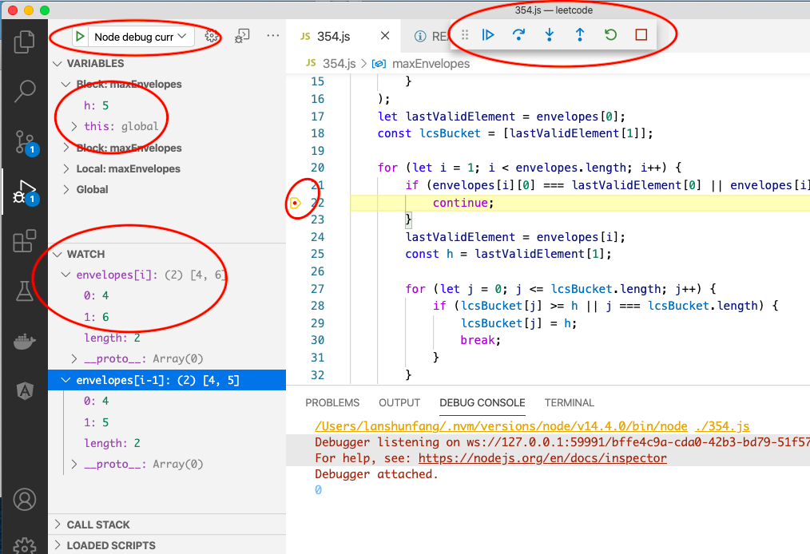

# Leetcode with VSCode Debugger launch.json
- It's useful to solve Leetcode problems within VSCode first as VSCode supports debugging
- Normally I use Javascript to do Leetcode issues; sometime Python or Java or Golang
- The project include launch.json and a list of extensions enable easier life while working with Leetcode

# Screenshots
